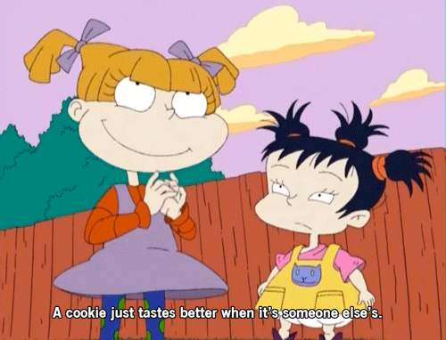

# Angelica's Anti-Bully App

## The Goal

As you may know, Angelica Pickles isn't the most well-disciplined girl in the Rugrats.

When she sees a naive baby, she bullies them - end of story.

But she's ready to make some nicer decisions - she just needs an app to help her keep track of these things. Let's build some functions that tell Angelica whether she's doing a good job of striving towards her goal of not bullying for the day.

## The Lab

Complete each challenge listed by coding out the functions described in the willpower.py file. Then code out your tests in the testwillpower.py file. Run those tests by entering `python testwillpower.py` in the console / command line / terminal.
