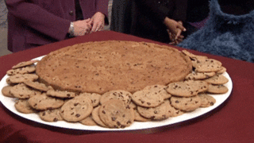

# Cookie Monster's Nutrition App

## The Goal

As you may know, Cookie Monster isn't the most well-disciplined character on Sesame Street.

When he sees a cookie, he eats it - end of story.

But he's ready to make some healthier choices - he just needs an app to help him keep track of these things. Let's build some functions that tell Cookie Monster whether he's doing a good job of striving towards his nutrition goals that day.

## The Lab

Complete each challenge listed by coding out the methods described in the diet.rb file. Then code out your tests in the testdiet.rb file. Run those tests by entering `python testdiet.py` in the console / command line / terminal.
